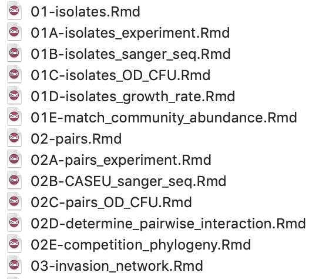

```{r include = FALSE}
knitr::opts_chunk$set(eval = TRUE, collapse = TRUE, comment = NA, tidy = FALSE)
```


I came across this tweet by Nick Strayer (@NicholasStrayer) on how to make a data-driven CV.

```{r echo = FALSE}
blogdown::shortcode("tweet", "1181254905018761216")
```

As soon as I saw this tweet, I decided to abandon my latest CV made in latex and change it to a cool data-driven CV! This is one of the most enjoyable moment using R to make (future) life easier, subsequent to indexing my Rmd files for data analysis. 


```{r echo = F, fig.cap="Having all Rmd for a project indexed is so relaxing.", fig.width=2, fig.height=2}

```

The blog post by Nick is really thorough so I am not going to go through it, but I do want to make a note for future me, in case I need to update my CV. 

The data-driven CV is based on two packages: `pagedown` and `tidyr`. `pagedown` enables the html to be printable in a nice pdf format, and `tidyr` gets together the CV information from a single csv file. Plus, great thanks to Nick that wrote the R functions communicating the csv to a well-styled CV. For people with terrible sense of art design like me, the template and default settings for the CV are really helpful. 

# Workflow for future me updating 

Here is my [CV](http://rpubs.com/ray57512/cyc-cv) and a one-page [resume](http://rpubs.com/ray57512/cyc_resume). The content is not fully compeleted yet, so I save the workflow for future CV update:

1. Update `positions.csv` that saves all personal CV information in a tidy format with well-defined variables.

2. Knit the `cv.Rmd` and `resume.Rmd` with the parameter `PDF_EXPORT <- TRUE`. 

3. Publish the knitted html on [Rpub](https://rpubs.com/) to obtain the links. Export the local knitted html files into pdf format. 

4. For updating website pdf links, move the pdf files to folder `static/pdf/`.

5. Push git commit and deploy the website.


