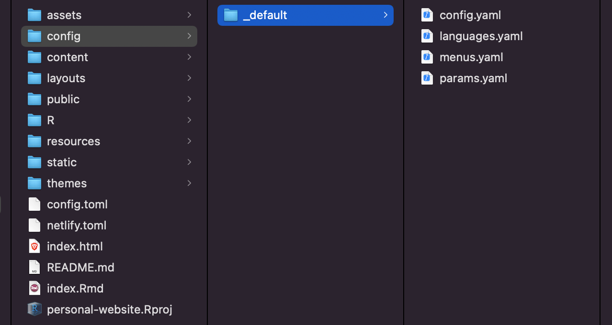
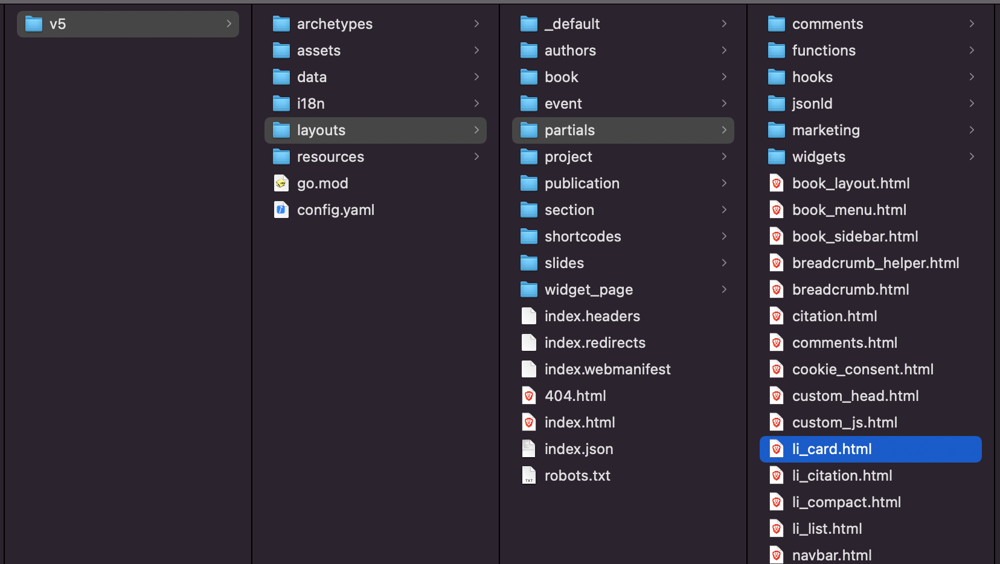
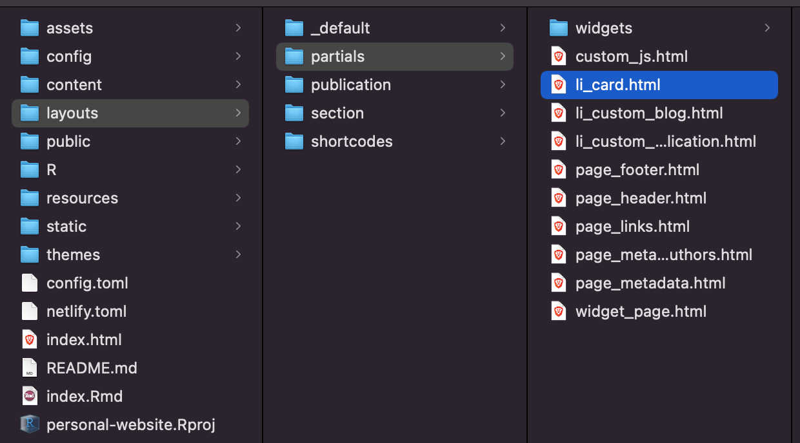
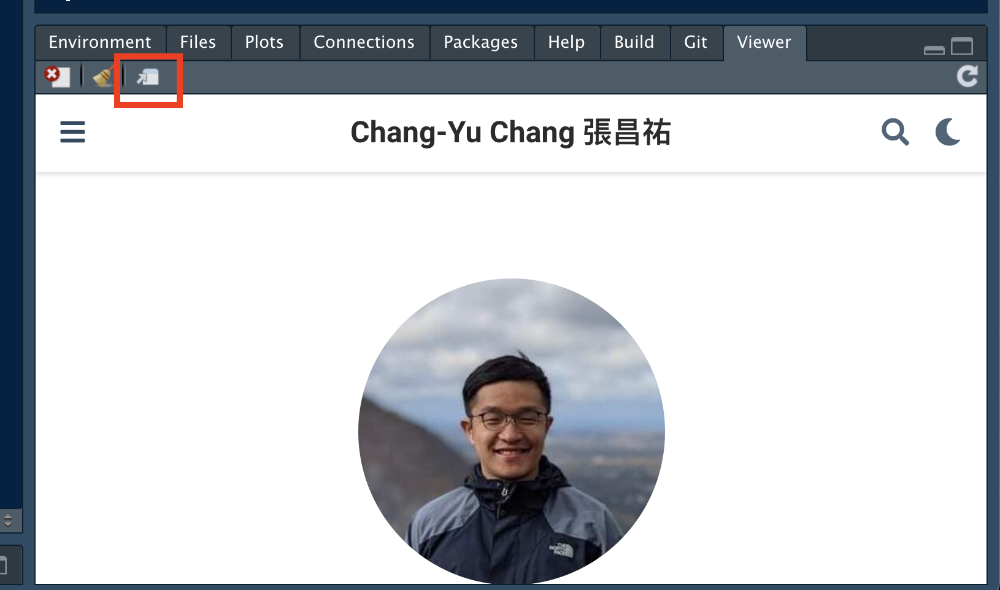

```{r include = FALSE}
knitr::opts_chunk$set(eval = TRUE, collapse = TRUE, comment = NA, tidy = FALSE)
```

### Welcome

Hello! About almost 4 years ago, I learned how to build this website using blogdown. Time flies and packages change. Recently I've delved into personalizing the theme of my website and now I feel more comfortable about the the package scope, so here is post.

This post aims to be a simple introduction on the technical issues on how to personalize a HUGO theme. No aesthetic choice will be included and I am not a HTML expert. It also does not mean to be a tutorial for building website from scratch. Instead, if you want to, you should follow [Up & running with blogdown in 2021](https://www.apreshill.com/blog/2020-12-new-year-new-blogdown/) by  blogdown's author Alison Hill.

Again introduction on some terms first. The information is from documentation of [blogdown](https://bookdown.org/yihui/blogdown/), [HUGO ](https://gohugo.io/documentation/) and [wowchemy](https://wowchemy.com/).

### Terms

- [blogdown](https://bookdown.org/yihui/blogdown/): a R package for making personal website. It depends on a couple of well-known R packages and functionalities, such as Rmarkdown, shiny. blogdown can be installed using CRAN in R console.

```
> install.packages("blogdown")
```

- [HUGO](https://gohugo.io/): an open-source static site generator on which blogdown is based. Most changes that you will make to the source html scripts should be referred to the HUGO syntax.

- [wowchemy](https://wowchemy.com/): a HUGO-based website builder. The theme I use comes from here. The section below will be orientated on how to modify the HTML source scripts by wowchemy.

- [TOML (Tom's Obvious, Minimal Language)](https://toml.io/en/): a file format for configuration files. When generating your site, HUGO will first look for the `config.toml` in the root directory.

### Configure HUGO theme: what can be changed?

The example here will follow the theme by [wowchemy](https://wowchemy.com/), which is incredibly convenient for building a virtual profile in academia. 

Basically we should configure the theme using built-in functionality. It allows you to choose from a couple of options for each page (such as card view or list view for showing the list publications). A step forward is to edit the html scripts such that you can fine-tune the syntax. I won't go into the details for what are the options or html syntax but instead focus on *HOW* to edit them.

#### Basic configuration

One file and two folders that are important. The `root_directory` refers to the root directory for your site. For R project user, this means the directory where `.Rproj` is located.

- `root_directory/config.toml`: specifies the titles, base url, google analytics tracking ID, etc.

- `root_directory/config/_default/`: 
    - `params.yaml`: change the built-in theme by wowchemy. I use `theme: minimal` and personalize it from there.
    - `menu.yaml`: the menu list shown on top of the site. I remove everything except for blogs, publications, and cv.
    - `languages.yaml`: the languages used throughout the site.
    - `config.yaml`: HUGO configuration. Important parameter is the path leading to the theme module being used. In my config, it says `wowchemy/wowchemy-hugo-modules/wowchemy/v5`. We will talk about it in depth in the next section.
    
```{r echo = F, fig.cap="root_directory/config/_default/", fig.width=2, fig.height=2}

```


#### Theme HTML

In the last section we learned that the source code to the wowchemy theme is located in `root_directory/themes/wowchemy/wowchemy-hugo-modules/wowchemy/v5/`. 

```{r echo = F, fig.cap="wowchemy/v5/layouts/partials/", fig.width=2, fig.height=2}

```

Basically, no change will be made to any subdirectory the folder `theme/`. What we are going to do is to make a duplicate folder with *EXACTLY* the same name and directory to the HTML script we want to modify.

For instance, if I want to modify `layouts/partials/li_card.html` under the `wowchemy/v5` directory. Instead of modifying it directly, I make corresponding files and path with identical name under my root directory.

```{r echo = F, fig.cap="root_directory/layouts/partials/", fig.width=2, fig.height=2}

```

Any change made to this html will overwrite the corresponding one located within `theme/`. You are all set to explore and tinker the theme!


### Workflow for personalizing theme

This is a step-wise workflow if you use Rstudio.

#### 1. Live serve the website

Live serve the website locally so that you can see how your website looks like in a browser.

```
> blogdown::serve_site
```

Rstudio should prompt the locally served website shown in the Rstudio Viewer. You might want to see how it looks like in a browser. On the top left of the Viewe there is a button "show in new window". 

```{r echo = F, fig.cap="Viewer/show in new window.", fig.width=2, fig.height=2}

```

Click on it and it should prompt to a new tab in your system preferred browser. You only need to do it once.

#### 2. Make some changes to the theme

Edit the theme whatever you like and save the changes. At this moment any changes you make to the source code (.Rmd for the content or html for the theme etc) should be immediately reflected in the website shown in that tab. You should see Rstudio Console live rendering the source code on save.

#### 3. Build website

Once you are happy with changes, build the website.

```
> blogdown::build_website()
```

The source HTML scripts for your website will be created in `public/`. My understanding is that the site deployment platform will deploy the site using the scripts here.


#### 4. git add, commit, and push

Like when we make new content, any changes should be channeled to the git repository that is linked to a website deployment platform (I use [netlify](https://www.netlify.com/)) in order for it to become live publicly. 

```
$ git add -A
$ git commit -m "your new feature added"
$ git push
```

#### 5. Publish the deployment

Go to netlify and check if the site deployment is successful. Preview it (it should be the same as your local version). If not, make sure that the local HUGO version and netlify deployment version match.

Check local HUGO version in R console.

```
> blogdown::hugo_version()
[1] ‘0.87.0’
```

To check HUGO version that netlify uses. Go to `root_directory/netlify.toml`.

```
[build.environment]
  HUGO_VERSION = "0.87.0"
```

Publish it if everything looks fabulous!


### Miscellaneous

#### Set enableGitInfo to false

Somehow my HUGO theme version sets `enableGitInfo = true`. According to HUGO documentation, Setting `enableGitInfo = true` enables`.GitInfo ` for each page and will update the `Lastmod` parameter. A consequence is that all with the `Lastmod` will be shown according to the latest git commit date for that content file.

To turn it off, locate it in `config/_default/config.yaml` and set it to false.

```
enableGitInfo = false
```


